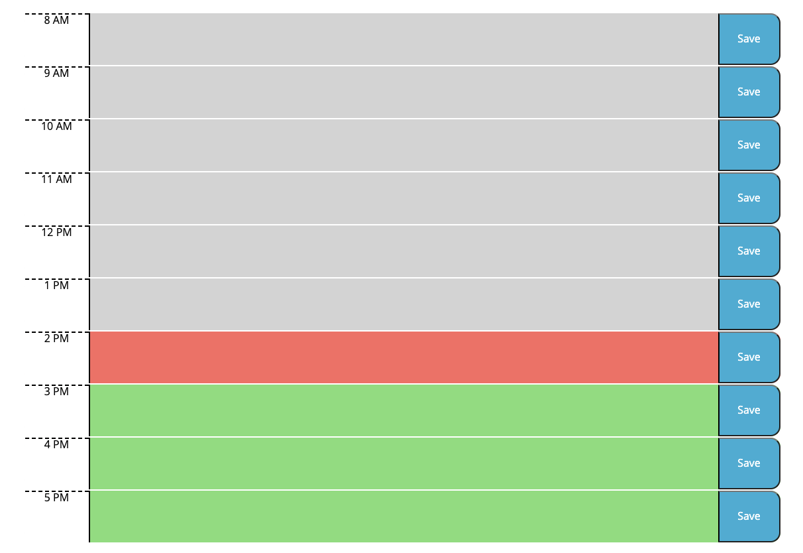
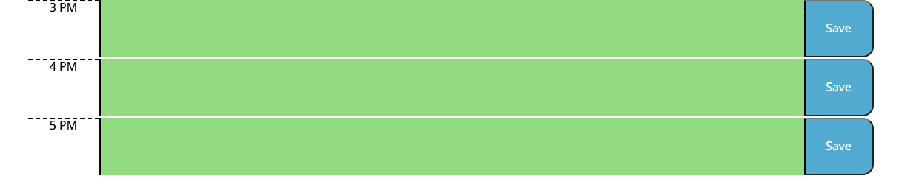

Description:

Are you tired of missing important business meetings? Missing critical conference calls? Or even forgetting to go to lunch?!?! 

If this sounds like you, then its time to PlanIt!

PlanIt is a powerful time management app that will change your work life FOREVER! We use industry leading technologies to deliver the best schduling experience on the PlanIt!

Never miss another important moment with current date display!


Schedule and write in all your important tasks on our spacious time block during all your hours of operation!



Time keeping is a piece of cake with our color coordination system.

Past tasks will be highlighted in grey.


Present tasks will be highlighted in Red.


Future tasks will be hightlighted in Green.



## User Story

```md
AS AN employee with a busy schedule
I WANT to add important events to a daily planner
SO THAT I can manage my time effectively
```

## Acceptance Criteria

```md
GIVEN I am using a daily planner to create a schedule
WHEN I open the planner
THEN the current day is displayed at the top of the calendar
WHEN I scroll down
THEN I am presented with timeblocks for standard business hours
WHEN I view the timeblocks for that day
THEN each timeblock is color coded to indicate whether it is in the past, present, or future
WHEN I click into a timeblock
THEN I can enter an event
WHEN I click the save button for that timeblock
THEN the text for that event is saved in local storage
WHEN I refresh the page
THEN the saved events persist